# ResortPass Tracker: UX, Design und Integrationen

Analyse und Umsetzung vom **30. September 2026**. Ziel: auf dem Handy schneller handeln, auf dem Desktop klarer orientieren und eigene Reisepläne zwischen Geräten nutzbar machen.

Die Prüfung begann auf der bestehenden Live-Seite und setzte sich im lokalen Produktions-Build fort. Untersucht wurden Startseite, Alert-Anmeldung, Besuchsplaner und Wartezeiten; zusätzlich wurden die gemeinsamen Ratgeber, Bildverwendung, Datenquellen und Sprachvarianten im Code geprüft. Das bestehende violett-gelbe Design bleibt die Grundlage. Es wurden keine Nutzungszahlen, Conversion-Raten oder Core Web Vitals erfunden.

## Ergebnis

Die fachliche Grundlage ist gut: sofortige Antwort auf die ResortPass-Frage, datierte Statusinformationen, kostenloses Double Opt-in, transparente Korrekturen, umfangreiche Planung und lokalisierte URLs. Die grössten Probleme waren die schwer sichtbare Breite des Angebots, lange Wege zu Planungswerkzeugen und eine überwiegend text-/illustrationsbasierte Darstellung. Diese Punkte wurden im selben Projekt verbessert.

Der Ausbau besteht aus einer mobilen Schnellnavigation, drei Aufgaben-Einstiegen, einem fotografischen Desktop-Hero, sechs Fotokarten, kontextbezogenen Bildern in allen zwölf Ratgebern und deren nächsten Schritten sowie einem lokalen Kalenderexport. Neue Texte und Bildcredits stehen in allen 17 Sprachen zur Verfügung.

## Geprüfte Schritte und Belege

| Schritt | Aufgabe | Vorher: Gesundheit | Ergebnis |
|---|---|---|---|
| 1 | Verkaufsstatus auf der Startseite verstehen | Gut: klare Statuspills und datierte Antwort. Desktopfläche überwiegend Text; grosse soziale Zahl und wiederholte Illustration konkurrieren mit der Aufgabe. | Text und reales Parkfoto nebeneinander; kompakter echter Abonnentenzähler erst nach erfolgreichem Abruf. Wiederholte Statusillustration entfernt. |
| 2 | Auf Mobile einen Alert finden | Gut: grosse primäre Aktion und sichtbarer Header-Alert. Andere Hauptaufgaben erst weiter unten. | Ständiger Schnellzugriff auf Pass, Wartezeiten, Prognose und Planung. Bestehender Alert bleibt erreichbar. |
| 3 | Alert-Anmeldung ausfüllen | Gut: E-Mail-Feld, zwei klare Passoptionen, kostenloses Angebot, Datenschutztext. Leeres Pflichtfeld wurde im Browser korrekt fokussiert. | Dock und Sticky-Alert überlappen nicht; Sticky-Alert verschwindet bei Formular und Footer. Keine echte Anmeldung ausgelöst. |
| 4 | Besuchsplaner erreichen | Verbesserungsbedarf: Inhaltsnavigation hinter dem grossen Foto; Werkzeug nach mehreren Bildschirmhöhen. | Werkzeugaktion direkt an der Hauptüberschrift; Inhaltsnavigation vor dem Foto. |
| 5 | Plan erstellen und mitnehmen | Gut: echte Auswahl und brauchbare Ergebnisse ohne minutengenaue Versprechen. Kein portabler Termin. | Optionaler Reisebeginn und `.ics` für die empfohlenen 1–3 Tage; eigene Planhinweise, keine Buchung. Geänderte Tageszahl wird als kleine Live-Region angekündigt. |
| 6 | Wartezeit suchen | Gut: aktuelle/alte Daten unterscheidbar, Suche, Filter, Favoriten und Themenbereiche. Suche nach Voltron reduzierte die Live-Liste auf einen Treffer. | Mobiler Wechsel zur Planung jederzeit möglich. Fotografie in der Erklärung; die zeitkritische Suche bleibt kompakt. |

### Startseite: vorher und nachher

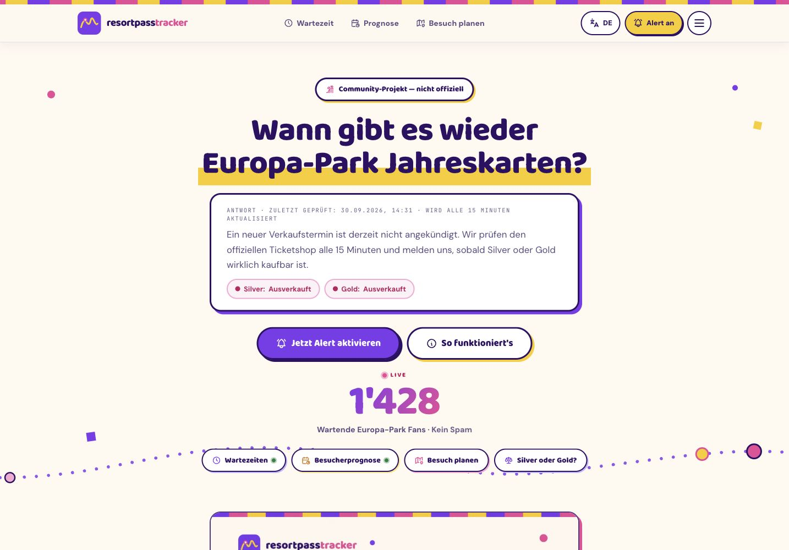

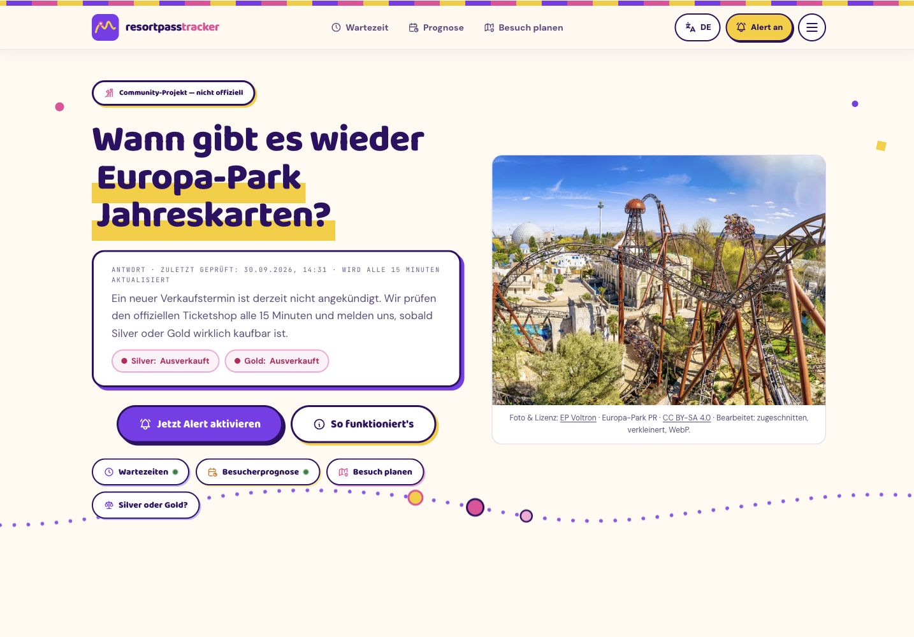

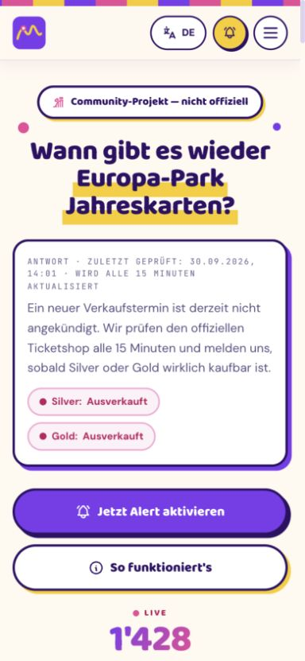

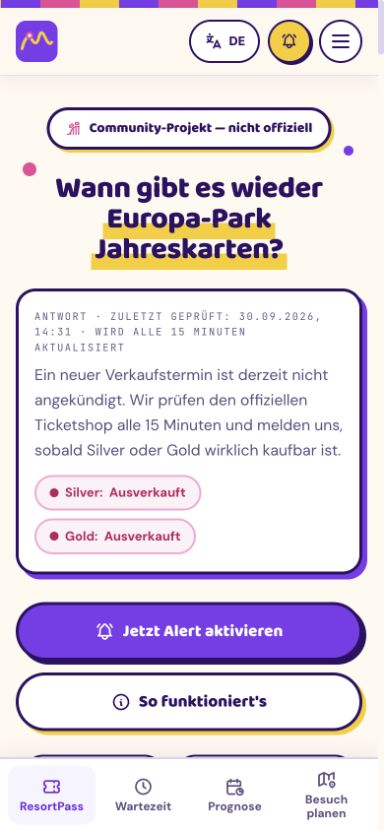

### Anmeldung und Planungswerkzeug

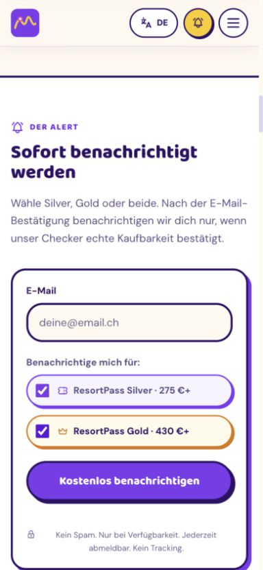

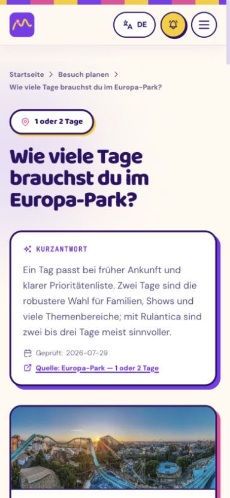

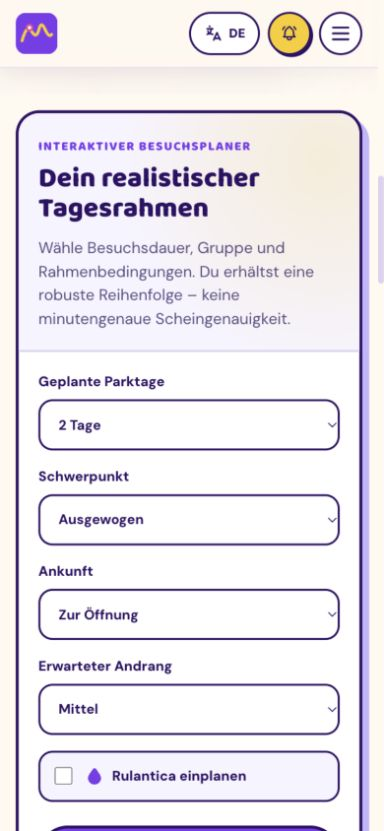

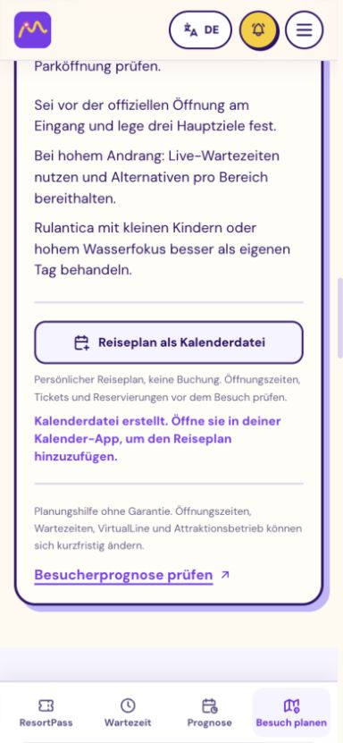

### Vor Ort, Fotokarten und Rechts-nach-links

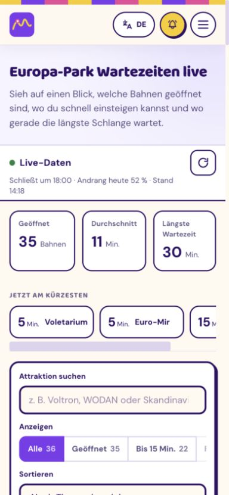

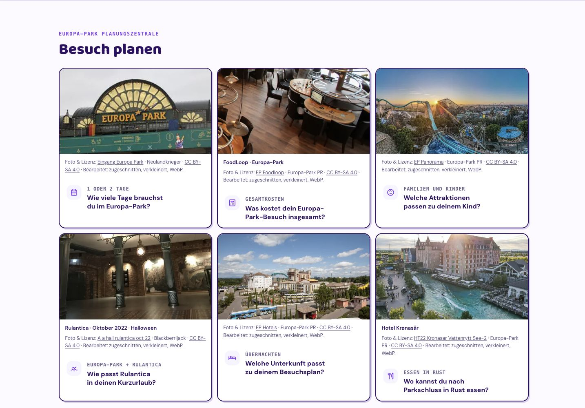

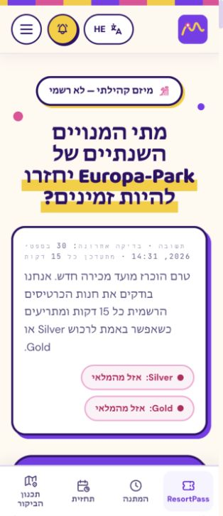

## UX- und Designentscheidungen

### Orientierung und Informationsarchitektur

Die Startseite verbindet jetzt drei Absichten: **ResortPass finden**, **Besuch planen**, **Heute im Park**. Die Aufgabe wird vor der Funktion benannt; kurze Beschreibungen erklären das Ergebnis des jeweiligen Wegs. Die bestehenden vier schnellen Hero-Links und die Ratgebernavigation bleiben verfügbar.

Auf Mobile gibt es vier direkte Ziele am unteren Bildschirmrand. Es sind echte lokalisierte Links; der aktuelle Bereich wird farblich markiert, die aktuelle Zielseite zusätzlich semantisch mit `aria-current`. Der aktive Planungsbereich umfasst auch Kosten, Familie, Essen, Unterkunft und Rulantica. Bildunterschriften oder technische Integrationsbegriffe erscheinen nicht als Ersatz für die Aufgabenbeschreibung.

Die zusätzliche Werkzeugaktion verhindert, dass Nutzer den ganzen Ratgeber lesen müssen, um einen Rechner zu bedienen. Quellen, Erklärung und FAQ bleiben daneben Teil derselben Seite.

### Mobile Bedienung und Zugänglichkeit

Die Dock-Ziele haben mindestens 56 Pixel Höhe. Safe-Area-Abstände berücksichtigen Geräte mit Home-Indikator. Ein ResizeObserver misst die tatsächliche Dock-Höhe; Body-Abstand und die Position des bestehenden Sticky-Alerts reagieren damit auch auf mehrzeilige Übersetzungen. Scroll-Abstände am Root verhindern, dass fokussierte Formularfelder hinter Header oder Dock verschwinden.

Der Header wurde mit geöffnetem Menü und Escape geprüft: das Menü schliesst und der Fokus kehrt zum auslösenden Button zurück. Die leere E-Mail-Pflichtprüfung fokussierte das Feld. Der Kalenderexport ohne Datum zeigte eine verständliche Meldung, setzte `aria-invalid` und fokussierte das Datumsfeld. Die resultierende Tageszahl und der Kalenderstatus sind jeweils kleine, atomare Live-Regionen; die ganze Route wird nicht ständig erneut vorgelesen.

Bei 320 × 740 und 390 × 844 Pixeln sowie bei 1440 × 1000 Pixeln wurde die Darstellung kontrolliert. Hebräisch zeigte korrektes RTL, einen umgebrochenen Planungslink und ausreichenden Abstand zum Dock. Quellenname, Autor und Lizenz werden in Bildcredits mit `bdi` isoliert. Ein vollständiger Screenreader-/WCAG-Nachweis oder ein 200-Prozent-Zoom-Audit wurde nicht durchgeführt.

### Fotografie und visuelle Hierarchie

Sieben Motive werden eingesetzt: Voltron, Parkpanorama, Parkeingang, FoodLoop, Resorthotels, Krønasår und Rulantica-Eingangshalle. Sechs davon wurden für diesen Auftrag als 18 responsive WebP-Dateien neu lokal aufbereitet. Die 480-Pixel-Dateien liegen ungefähr zwischen 14 und 49 KB; ein Handy lädt nicht automatisch die 1200-Pixel-Fassung.

Fotos dienen dem konkreten Kontext: Eingang für Besuch/Reservierung, FoodLoop für das Gesamtbudget, Hotels für Übernachtung, Krønasår als ausdrücklich bezeichnetes Hotelmotiv. Das Rulantica-Bild ist als **Oktober 2022 / Halloween** datiert; breite Ausschnitte richten sich nach unten auf die Architektur. Es gibt keine erfundenen Angebots-, Zimmer- oder Restaurantfotos. Bilder mit hervorgehobenen erkennbaren Badegästen werden weiterhin nicht verwendet.

Autor, Originaltitel/Quelle, **CC BY-SA 4.0**, Lizenzlink und Bearbeitung stehen direkt am Bild. Bilder und Credits stehen ausserhalb der Hauptlinks von Karten; damit entstehen keine verschachtelten Links. Hauptfotos im Hero können früh laden, die übrigen laden verzögert mit festen Maßen. Der breite Desktop-Hero wurde in der tatsächlichen Browserdarstellung geprüft; die mobile Priorität bleibt Status und Alert.

Die [Fotodokumentation](../docs/licensed-photos-2026-09-30.md) enthält Revisionen, Downloadnachweise, Bildmaße, Bearbeitungen und Prüfgrenzen. Die bearbeiteten Bildfassungen bleiben unter CC BY-SA 4.0; die MIT-Lizenz des Codes ersetzt deren Bildlizenz nicht.

### Vertrauen, Aktualität und Inhalte

Eine fest eingeblendete Zahl von 800 wurde entfernt. Der Abonnentenzähler erscheint erst nach einer erfolgreichen Antwort mit einer tatsächlichen Zahl. Bei fehlender API entsteht keine erfundene soziale Bestätigung.

SQLite-Zeitstempel aus der Status-API sind UTC, obwohl sie ohne Zeitzonenkennung kommen können. Der Build normalisiert sie jetzt als UTC, statt sie als lokale Uhrzeit zu interpretieren. Das verhindert einen falschen Abstand von zwei Stunden in der Schweizer Sommerzeit; ein Regressionstest sichert den gleichen Zeitpunkt mit und ohne expliziten Offset ab.

19 von 36 zentralen Fakten waren beim Start nachprüfungsbedürftig. Sie wurden anhand der verlinkten offiziellen Quellen erneut geprüft und unverändert bestätigt. Nur deren Prüfdaten wurden auf **30. September 2026**, nächste Prüfung **1. November 2026**, gesetzt. Die übrigen 17 Datensätze und sämtliche Werte/Quellen wurden beibehalten. Das ist kein pauschaler neuer Prüfzeitpunkt für jeden Ratgebertext.

## Integrationen und automatische Auslöser

Der sofort nutzbare Sweet Spot ist der Kalenderexport: **Startdatum und Plan wählen → Kalenderaktion drücken → lokale Datei**. Der Export enthält eigene Route, empfohlene Tage, Hinweise und den lokalisierten Planerlink. Er greift auf kein Kalenderkonto zu und überträgt keine E-Mail-Adresse oder fremde Live-Datentabelle.

Die [vollständige Integrationsanalyse](../docs/integrations-2026-09-30.md) priorisiert danach:

1. Bestätigter Verkaufswechsel → ausdrücklich abonniertes Statusereignis zusätzlich zum bestehenden E-Mail-Alert.
2. Passende ResortPass-/Planungsfrage → eigene lesende MCP-Werkzeuge mit Prüfzeitpunkt und Quellenlink.
3. Fälliger Fakten- oder Bildreview → Quellenprüfung und prüfbarer Aktualisierungsvorschlag.
4. Relevantes GitHub-PR-Ereignis → gezielter mobiler Design-, Formular- und Lizenzreview.

Installierte Skills können passend zur Chat-Aufgabe ausgewählt werden. Ein MCP-Werkzeug allein startet keinen Hintergrundlauf. Echte Ereignis-Tasks beziehungsweise MCP Events benötigen unterstützte Plattformen, Kontoberechtigungen, ausdrückliche Abos und eine implementierte Zustellung. GitHub ist im geprüften Plugin-Katalog installiert; Kalender, Gmail und Linear sind mögliche weitere Verbindungen. Es wurden keine Plugins installiert und keine neuen Hintergrund- oder Ereignisaufgaben aktiviert.

## Offene Prioritäten

| Priorität | Befund | Nächste sinnvolle Arbeit |
|---|---|---|
| P1 | Aktuelle unbekannte Statusantworten können durch den alten committed `sold_out`-Snapshot ersetzt werden. | Historischen Nachweis und aktuelle Ungewissheit ausdrücklich auseinanderhalten. |
| P1 | Live-Karten und -Pills aktualisieren sich; längere Verfügbarkeitsantworten und FAQ folgen dem Build. | Eine Zustandsformatierung für alle sichtbaren und strukturierten Antworten einsetzen. |
| P2 | Ein unbekannter und ein ausverkaufter Pass werden in der ausführlichen Antwort zusammengefasst. | Pro Pass antworten und Unknown sichtbar behalten. |
| P2 | Einzelne Ratgeber haben langfristig fixierte Texte zur derzeitigen Nichtverfügbarkeit. | Datierte Beobachtung und Link zum aktuellen Status verwenden. |
| P2 | Kalenderdatei ist erzeugbar; nativer Kalenderimport wurde nicht mit einer echten Kalender-App getestet. | Import in iOS Kalender, Google Calendar und Outlook mit denselben Sprach-/Datumsfällen prüfen. |
| P2 | Keine reale Nutzerstudie und keine gemessene Conversion-/Performanceverbesserung. | Drei kleine Aufgaben-Tests mit Erstbesuchern; danach gezielte Performance-Messung unter Mobilnetzbedingungen. |

Die ersten vier Befunde bestehen bereits im Projekt und sind genauer im Integrationsbericht beschrieben. Die jetzigen Änderungen bewahren die fachlichen Funktionen, statt die gesamte Statusarchitektur gleichzeitig umzubauen.

## Verifikation und Grenzen

- **159 Tests bestanden**, einschließlich Kalenderdatum, Jahreswechsel, exklusivem Enddatum, UTF-8-Zeilenfaltung, Text-Escaping, aller 17 neuen Sprachpakete und UTC-Statuszeitstempeln.
- Typprüfung bestanden; **334 Seiten** gebaut; statische QA für **204 Ratgeber in 17 Sprachen** und vollständige SEO-/Sitemap-Prüfung bestanden.
- Browserprüfung: Hauptaktionen, Suche auf der bestehenden Live-Seite, Leerfeldvalidierung ohne Anmeldung, Planer mit 1 Tag/hohem Andrang/Rulantica → 3 empfohlene Tage, Kalenderaktion mit Erfolgsmeldung, RTL und Escape-Fokus.
- Bilder laden mit passenden responsiven Quellen; keine verschachtelten Links in den Fotokarten. Mobil kein horizontaler Seitenoverflow in den geprüften Zuständen.
- Im lokalen Produktions-Preview läuft nur das statische Frontend. Live-API-Bereiche zeigen deshalb ihre vorhandenen Fehler-/Fallbackzustände; es wurde kein produktives Abo angelegt oder verändert.
- Der In-App-Browser zeigte „Kalenderdatei erstellt“, lieferte aber kein Download-Ereignis an die Browserautomatisierung. Die Dateiserialisierung wurde mit Tests geprüft; ein tatsächlich gespeicherter Browserdownload oder Kalenderimport wird deshalb nicht als vollständig verifiziert behauptet.
- Live-Verkaufswechsel, Newsletter-Zustellung, echte Ausfälle und alle 17 Sprachen wurden nicht jeweils als kompletter manueller Browserlauf reproduziert. Bildmetadaten und Sprach-/Buildinvarianten wurden automatisiert geprüft.

Screenshots und Befunde gehören zu diesem aktuellen Lauf. Die Änderungen wurden lokal umgesetzt und geprüft; ein Produktionsdeployment ist ein eigener Schritt.
